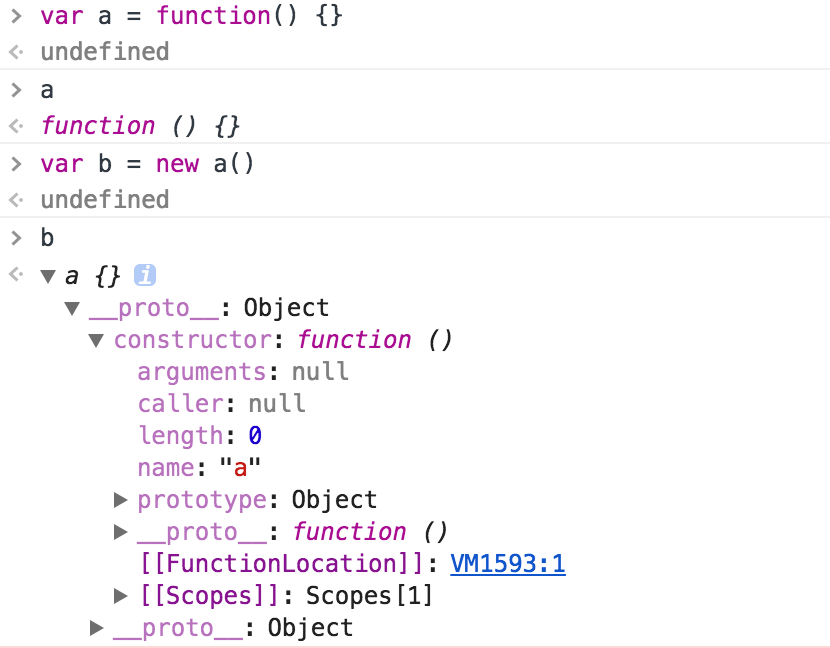

# ES6 箭头函数的一些特性

## 什么是箭头函数

`es6 javascript arrow function`

箭头函数作为 ES6 的新特性，很多时候可以替换掉普通函数，像这样：

```javascript
// arrow function
const a = a => a++;
// normal function
const a = function(a) {
  return a++;
};
```

但是箭头函数中的 this 指向就需要再理解下了，Mozilla 中给出的文档如下：

> An arrow function expression has a shorter syntax than a function expression and does not bind its own this, arguments, super, or new.target. These function expressions are best suited for non-method functions, and they cannot be used as constructors.

文档中说的 does not bind its own this，这里的 own 指的是作用域链（scope chain）还是原型链（prototype chain）？

## 指向哪里？

作用域链和原型链

### 作用域链

JS 是静态作用域的语言，对于静态作用域来说，变量的作用域是在变量声明时产生的。

在 ES6 之前 JS 不存在块级作用域，即在块内声明的变量会被提升到整个作用域内（全局或者函数）。所以在 ES6 之前，要创建自己的命名空间的话，就需要依靠函数来实现。

JS 的作用域是静态作用域，也叫词法作用域，他的所有变量都有一个自己的作用域和生存周期（执行上下文），当变量执行上下文没有被引用或者执行结束的时候，变量就会被销毁回收。

作用域是静态产生的，在定义变量的时候就已经确定，在 JS 里，通常存在全局作用域和函数作用域，自由变量的取值是根据变量在其作用域下沿着内层往外层寻找到的第一个同名变量，自由变量这种寻找取值的查找方式就是从自己的作用域一直寻找到全局作用域，这之间通过的所有作用域就是一个作用域链。

作用域链在 JS 里，即从全局到一个函数内部，从全局到一个对象的函数属性的内容。

JS 的执行环境上下文就是语法解析过程中指令入栈和出栈的过程，一个函数在执行过程中，会产生一个函数执行上下文到栈里面，其中包括变量声明／变量赋值／this 赋值／参数赋值，在函数调用结束后，如果不存在内部变量被引用的情况，执行环境上下文就会被销毁和回收，如果存在被引用的内部变量，则不会被回收。

这里自由变量的取值一定是在其被创建的作用域下，由内层到全局作用域的一个查找过程。

### 原型链

说到原型链第一个想到的问题是，为什么会存在原型链这种设计？ JS 是弱类型语言，所谓弱类型，就是没有严格的类型校验，比如

```javascript
var a = 1;
var a = "hello <3";
var a = {}; // new Object()
var a = function() {};
var a = true;
```

这里仅从变量的声明来看是看不出变量的类型的，如果是 C 或者 C++的话，则在声明期间就可以看出变量的类型，同时如果变量赋值和声明类型不一致的话，编译器就会在编译期报错。

但是如果是弱类型的 JS 的话，就不好办了，只能到运行期出现与预期结果不一致时，才会发现 BUG。

而且弱类型的变量计算存在隐式类型转换，常见的`==`操作符就会对变量类型做隐式转换，然后再判断是否相等，其他的操作比如 string 和 number 类型的相加也会，等等等。

JS 的数据类型一般可以分为两类：值类型和引用类型。

值类型比如 Number／Boolen／Char／String／Undefined；
引用类型就是剩下的 Null／Object／Array／Function／Date／Math 等等。

对于值类型来说，就是字面常量，这里从 chrome 的 console 控制台可以看一下值类型的属性：


这里可以看到至少有一个`__proto__`属性，下面有个 constructor，还有一些其他方法；再看一下 Object 在 chrome 下的 console 情况：


从输出情况来看，不管是对于引用类型还是值类型，真的都是对象！

即所有的变量都是对象，而且都有一个`__proto__`属性。

说了这么多，只想说明一个问题，对于 JS 的所有变量来说，都需要构造函数来生成。

虽然 JS 中有可以直接声明引用类型的语法，但是都是包裹了语法糖的，对于构造函数来说，面向对象程序设计里是一个类的基本方法，构造函数和析构函数，一个用来创建类 Class 实例，一个用来释放类实例。

那么 JS 中的 Object 到底算不算是一个类呢？答案肯定是的，只不过 ES6 之前没有实现基于类的一系列语法操作而已，比如 public／private／protect 方法，类的 inherit／extend，在 OO 里面这些概念都没有实现，但是并不妨碍 JS 也可以作为一门面向 OO 的编程语言。

上面说了，对于 JS 的变量来说，需要一个 contractor 来生成需要的实例对象，比如 Array／Date／Math／Function／Object，那么构造函数在哪里呢？答案是在`__proto__`里面。

从 Object 的 console 中可以看到，`__proto__`下有个属性叫 constructor，再点开 constructor，可以看到 constructor 下面又是一堆的属性，而 constructor 本身是一个 Object 的构造函数。

再测试一下 function 的构造函数

```javascript
var fn = function() {};
var a = new fn();
console.log(a);
```



从上图可以看到这时候的 constructor 是一个 function 的构造函数了,对于 Array 来说，constructor 就是一个 Array 的构造函数，整数来说就是一个 Number 的构造函数。

通常创建一个类的实例直接从对应的类实例化一个即可，同时一些基本的方法可以直接在类中定义，在实例中调用。但是 ES6 之前是没有类这个概念的，实际上对于编译器来说，如果解析一个类和如何构造实例这类问题也已经超出了这篇要讨论的范围，这里谈一下 JS 是如何设计类的。

首先，所有的函数（构造函数）都有一个 prototype 属性（类方法集合），这个属性指向的是 Type.prototype。

那么 Type.prototype （原型实例）是个什么东西呢？当然是另外一个 Object 啦。

再看构造的对象实例，有一个`__proto__`属性，这个属性指向的是构造函数的 prototype，也就是前面说的 Type.prototype。

比如`var a = {}`，那么得到的 a 的`__proto__`指向的就是 Object 的 constructor （function Object(){[Native Code]}）的 prototype(Object.prototype)，即 Object.

而 function Object()的 protptype 指向的又是 Object.prototype。

这里可以这么理解，JS 为了给实例继承不同类型的共有方法，把公有（public）的方法提取出来，放到一个叫 prototype 的属性下面，于是可以看到 Object.prototype/Function.prototype/Array.prototype/String.prototype 等。

而构造函数的 Prototype 刚好是是指向这些公有方法的聚合体--Type.prototype,于是我们可以理解，从构造函数中产生的对象就带有一个隐式的原型链，这个原型链指向的是对应类型公共方法的集合（Type.prototype），而且 JS 在方法调用上，是通过原型链查找来找到对应的方法的，对于一个 String，比如要使用 split 这个方法，则会先在自己的属性中去寻找个方法，如果没有找到，就会继续沿着`__proto__`这个链指向的对象去找，如果最终没有找到的话，就会抛出异常。

整理一下：

所有变量都是对象。
每个对象都有一个自己的构造函数 constructor function
每个变量类型都有自己一套公用的方法集合 type.prototype
每个构造函数都有一个原型链 protptype，指向的是对应的公用方法集合 type.protptype
每有个实例对象都有一个隐式原型链`__proto__`，指向的是对应的公用方法集合 type.prototype

现在还有两个地方的`__proto__`指向不明，第一个是构造函数的`__proto__`，第二个是 type.prototype 的`__proto__`

首先构造函数的`__proto__`指向的是都指向 Function.prototype，因为构造函数都是函数，各个类型的构造函数指向 Function 也是可以理解的，因为 JS 中的所有函数都是通过 Function 来构造的，比如：

```javascript
var fn = new Function("args", "return args");
```

然后就剩下各个类型的公用方法集合 type.prototype.`__proto__`了，这里除了 Object.prototype.`__proto__`指向 null 以外，其他的 type.prototype.`__proto__`都指向 Object.prototype,因为对于集合来说，`__proto__`当然是指向集合的公用方法集合（Object.prototype）了。

## 指向这里！

好了，在弄清楚了作用域链和原型链之后，我们来看看 this 的指向：

首先，全局下的 this 指向的是 windows，global 对象

函数作用域内的 this 指向的是函数的调用者，通常在全局调用的函数指向的是 global 对象

对象属性的函数作用域内的 this 指向的是该类

简单几个例子：

```javascript
var a = function() {
  console.log(this);
};
a(); // => window

var b = {};
b.a = a;
b.a(); // => {a:function}

var c = () => {
  console.log(this);
};
b.c = c;
b.c(); // => window

var d = function() {
  var f = function() {
    console.log(this);
  };
  f();
};
d(); // => window
```

最后终于到我们的箭头函数了，那么问题来了，箭头函数中的 this 指向的是哪里呢？

答案是继承的外部词法作用域的 this，对于一个箭头函数来说，其执行上下文不会创建新的 this，而是会继承外部作用域的 this。上面例子中的 b.c()就是，c 这个函数继承的是全局的作用域，而在全局作用域下的 this 指向的就是 global。再试试下面的用例：

```javascript
var fn = function() {
  var val = 1;
  var arrFn = () => {
    console.log(this, val);
  };
  arrFn();
};
fn(); // window, undefined

var fnn = function(args) {
  this.val = args;
  this.arrFn = () => {
    console.log(this, this.val);
  };
};
var a = new fnn("hello");
a.arrFn(); // {val: 'hello', arrFn: function}
```

详细的可以参见这篇[箭头函数中 this 的用法](https://github.com/zhengweikeng/blog/issues/11)
